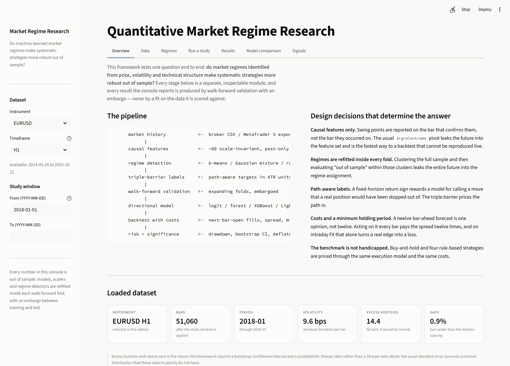
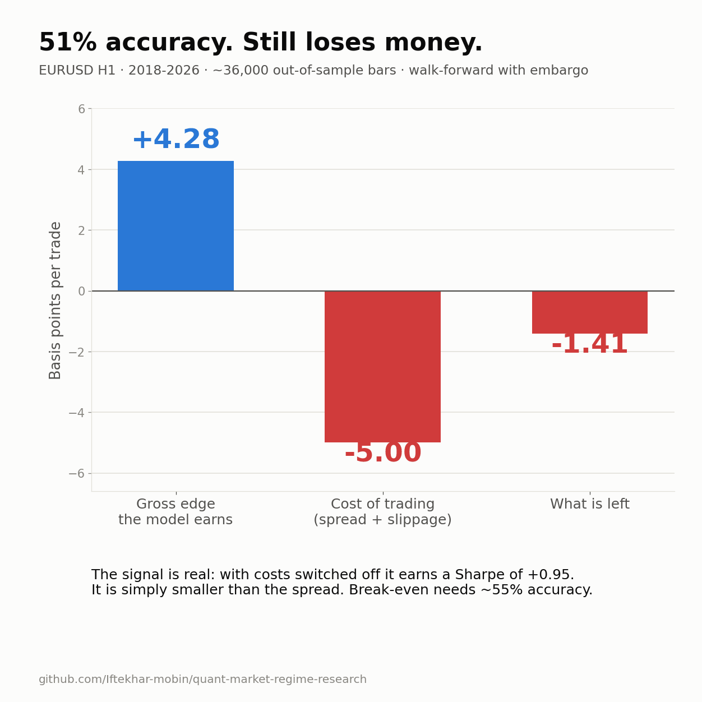
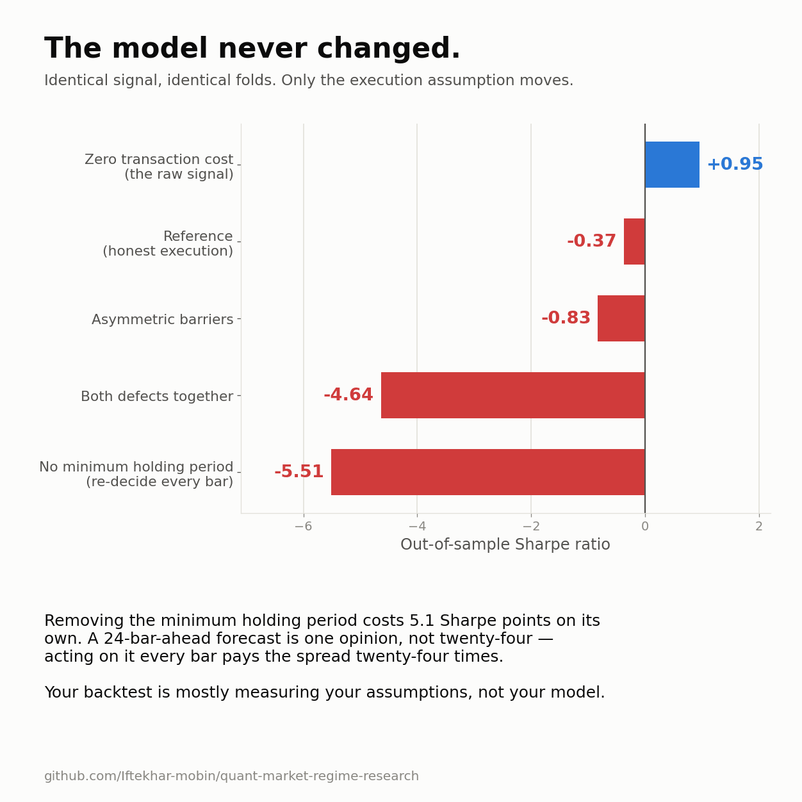
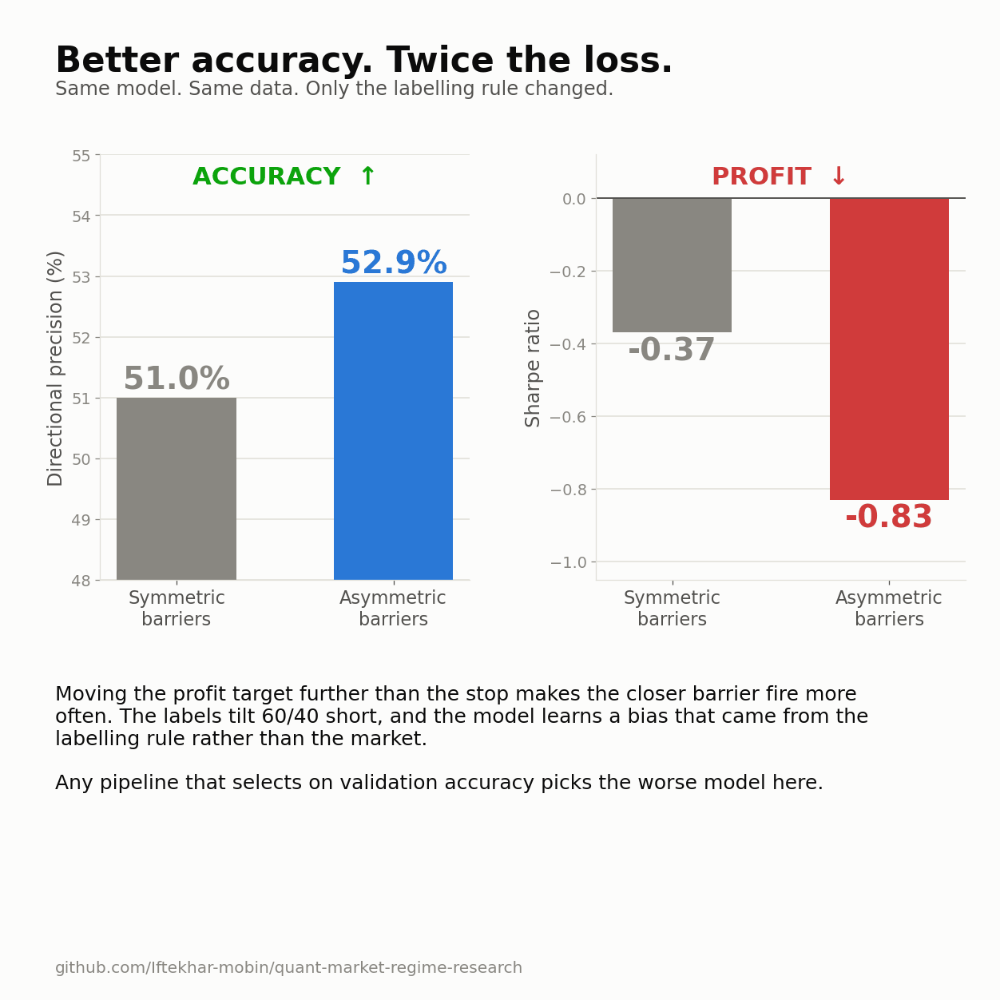
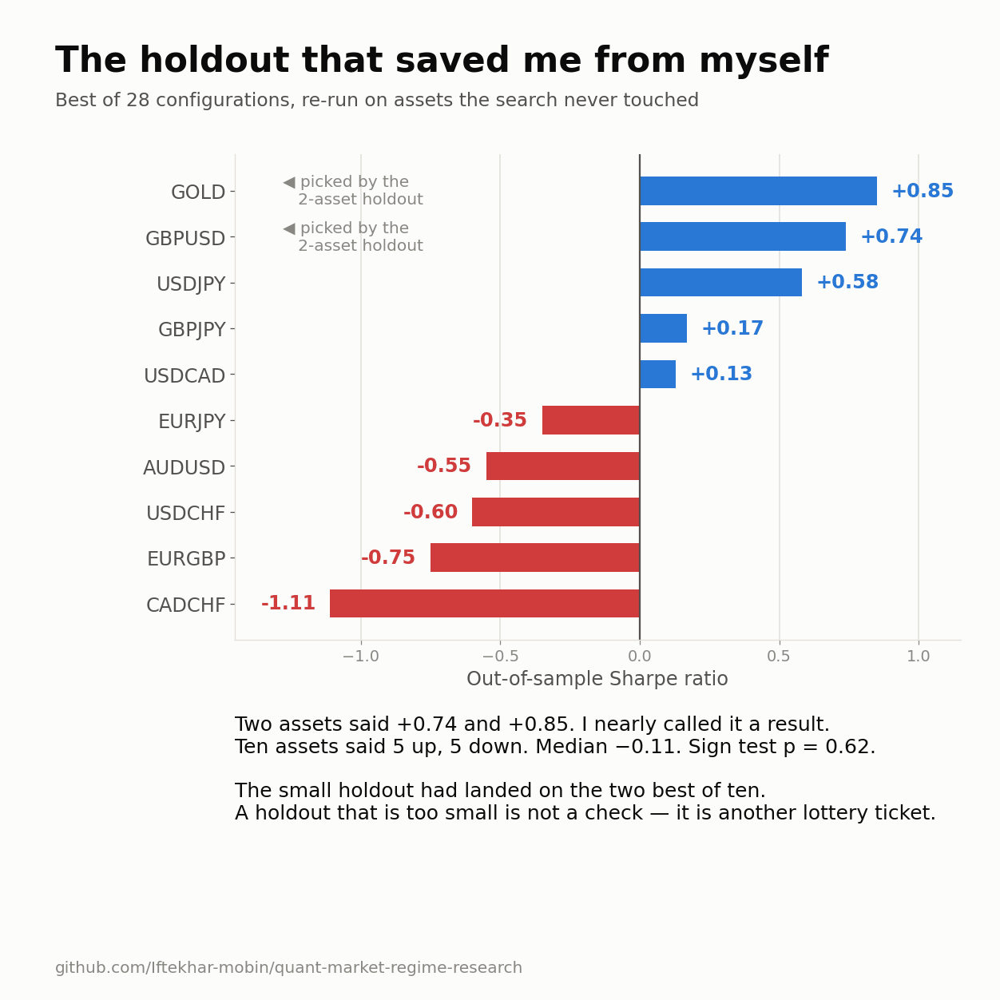
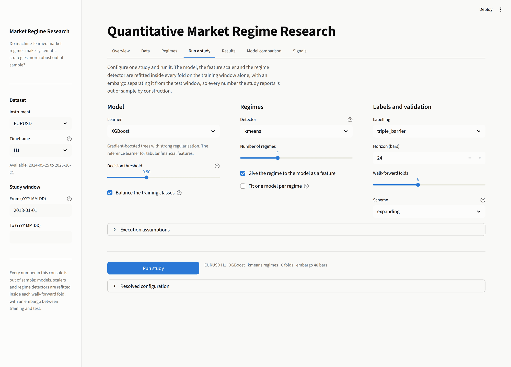
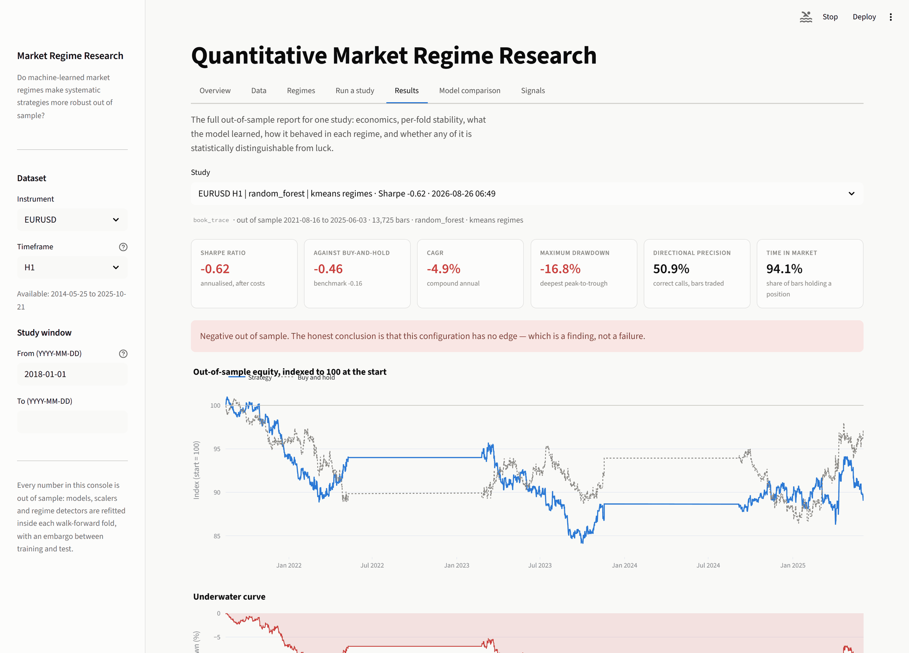
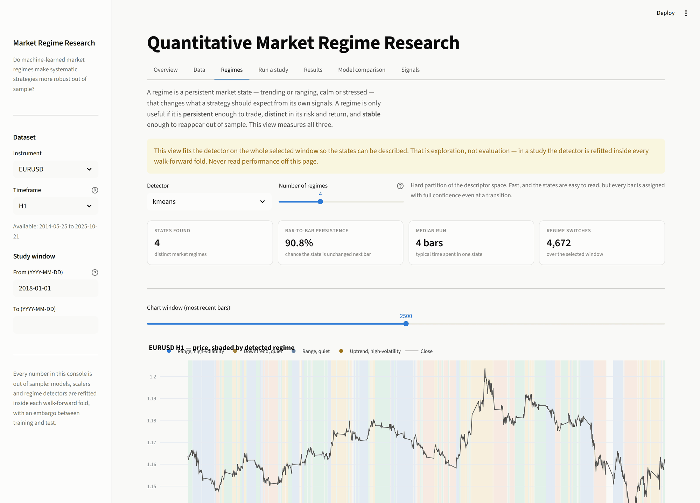
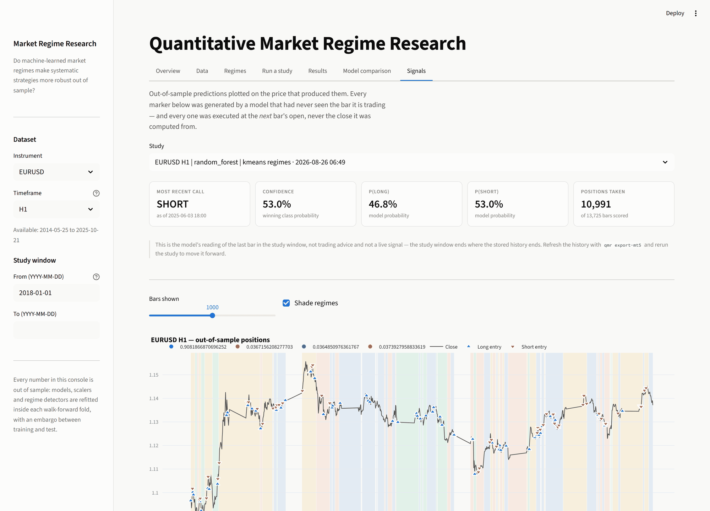

# Quantitative Market Regime Research

[](https://quant-market-regime-research.streamlit.app)
[](LICENSE)
[](pyproject.toml)

A research framework for testing whether **market regimes** — persistent states
of trend, volatility and structure — make systematic strategies more robust out
of sample.

It is built as a study, not as a trading bot. Every number comes from purged
walk-forward validation with an embargo, priced through an execution model with
realistic costs, and reported with a confidence interval and a correction for
how many configurations were tried. The framework is designed to be able to
return the answer "no" — and on the sample studied here, it does, including
about its own most promising result.

```
   data  ->  causal features  ->  regime detection  ->  triple-barrier labels
         ->  walk-forward CV  ->  directional model  ->  backtest with costs
         ->  risk analysis    ->  significance tests
```

**Try it without installing anything — the console is live at
[quant-market-regime-research.streamlit.app](https://quant-market-regime-research.streamlit.app).**

[](https://quant-market-regime-research.streamlit.app)

<sub>The Overview tab states the question, the pipeline and the four design
decisions that determine the answer, then loads the dataset it will be asked
about — 51,060 EURUSD H1 bars, excess kurtosis 14.4, which is why this framework
reports a bootstrap confidence interval rather than a Sharpe ratio alone.</sub>

---

## The research question

> Do market regimes identified from price, volatility and technical structure
> improve the robustness of systematic trading strategies?

"Improve" is defined before the results are in: a regime-conditioned arm must
raise the out-of-sample Sharpe ratio against an identical control arm
(`regime.method = none`) **and** do so on more than half of the folds. Same
features, same labels, same folds, same costs, same seed — the regime layer is
the only difference.

---

## Findings

EURUSD H1, 2018–2026. Six expanding folds, 24-bar label horizon, 48-bar embargo,
minimum holding period equal to the label horizon, 2.5 bps charged on every
change in position (5.0 bps a round trip). ~36,000 out-of-sample bars per arm.

### 1. Every learner finds the same small edge

| Learner | Regimes | Directional precision | Sharpe (OOS) | CAGR | Max drawdown |
|---|---|---|---|---|---|
| Random forest | none | 51.00% | **−0.37** | −3.2% | −26.9% |
| Random forest | k-means | 51.00% | −0.77 | −6.1% | −30.9% |
| LightGBM | k-means | 51.21% | −1.37 | −11.1% | −50.8% |
| XGBoost | k-means | 51.42% | −1.40 | −11.0% | −50.2% |
| LightGBM | none | 51.46% | −1.57 | −12.6% | −55.8% |
| Logistic regression | k-means | 50.73% | −1.66 | −12.8% | −57.1% |
| XGBoost | none | 51.50% | −1.71 | −13.6% | −57.5% |
| Logistic regression | none | 50.86% | −1.79 | −13.7% | −60.4% |

Precision spans **50.7% to 51.5%** across four model families, from a
regularised logit to two gradient-boosting libraries. A linear model extracts
essentially all the signal these features contain; the choice of learner is not
what limits the result.

### 2. The signal is real. The spread is bigger.

The identical signal, run with costs switched off:

| | Total return | Per trade | Sharpe | Max drawdown |
|---|---|---|---|---|
| Reference | −17.1% | **−1.41 bps** | −0.37 | −26.9% |
| Zero transaction cost | +51.6% | **+4.28 bps** | **+0.95** | −9.7% |



Out of sample, on bars it had never seen, the model earns **+4.28 bps per trade
— a Sharpe of 0.95 with a single-digit drawdown**. The round trip costs 5.0 bps.
The edge is real and smaller than the toll.

The break-even hit rate at these costs is about **55%**. The models reach 51%.
That gap is the central result, and it is why this repository prints return per
trade beside precision.

### 3. Execution assumptions move the result more than the model does

Identical window, learner, horizon, folds and seed — only the named assumption
changes:

| Arm | Precision | Trades | Sharpe |
|---|---|---|---|
| **Reference** | 51.0% | 1,206 | −0.37 |
| No minimum holding period | 51.0% | 4,925 | **−5.51** |
| Asymmetric barriers (1.5/1.0 ATR) | **52.9%** | 888 | −0.83 |
| Zero transaction cost | 51.0% | 1,206 | **+0.95** |



Row 3 is the one to stare at. Making the barriers asymmetric **raises**
directional precision from 51.0% to 52.9% and more than doubles the loss: the
closer barrier is hit more often, the labels tilt 60/40 short, and a model that
leans short in a market that did not fall scores better on the classification
metric while losing more money. **Any pipeline that selects on validation
accuracy prefers the worse configuration here.**



### 4. The regime effect is not stable enough to have a sign

An earlier version of this table showed regimes hurting in 3 of 4 matched pairs.
A refactor that changed nothing about the regime logic — only how feature and
label indices are aligned, moving fold boundaries by a few bars — reversed it to
regimes *helping* in 3 of 4, mean **+0.06 Sharpe**.

Neither is a finding. **The instability is the finding**: an effect whose sign
flips under an incidental change is noise, and this study cannot resolve a
regime effect of the size that might plausibly exist.

### 5. A 28-configuration search for a positive Sharpe

Logged in full in [`reports/improvement_ablation.csv`](reports/improvement_ablation.csv).
Execution levers, meta-labelling (a rule picks the direction, the model picks
the trades), seven primary rules, four learners, seed ensembling, slower
timeframes.

- Best arm: **+0.28 Sharpe**, 95% CI **[−0.78, +1.33]**, deflated Sharpe
  **0.000**.
- **5 of 28 arms positive** — fewer than the ~14 that chance alone would produce,
  so the population of configurations is centred below zero.
- The same configuration measured with 6 folds instead of 3: **+0.13 → −0.13**.

**The holdout.** The winner, re-run on instruments the search never touched:
first on two (GBPUSD **+0.74**, GOLD **+0.85** — both positive, both *better*
than where it was tuned), then on ten:

**5 of 10 positive. Median Sharpe −0.11. Sign test p = 0.62.**



It did not survive. The two-instrument holdout had simply landed on the two best
of ten — **a holdout that is too small is not a check, it is another lottery
ticket.** Reproduce with `python scripts/run_improvement_study.py --holdout`.

### What the finding is not

Not "machine learning does not work in markets". It is a bounded claim about one
instrument class, one timeframe, one feature set and one cost assumption. Where
to push next is set out in [docs/findings.md](docs/findings.md) §6.

---

## The research console

**Live on Streamlit Community Cloud: [quant-market-regime-research.streamlit.app](https://quant-market-regime-research.streamlit.app)**

Or run it locally against your own market history:

```bash
qmr console          # or: streamlit run app/main.py
```

| Tab | What it is for |
|---|---|
| **Overview** | The question, the pipeline, and the decisions that determine the answer |
| **Data** | Price and features, return distribution, and the prediction target |
| **Regimes** | Fit a detector; measure persistence, distinctness and stability |
| **Run a study** | Configure and launch a walk-forward experiment, with a live log |
| **Results** | Economics, fold stability, regime breakdown, feature importance, significance |
| **Model comparison** | Every stored study side by side, regime arms paired against their controls |
| **Signals** | Out-of-sample positions on the chart, with the model's conviction over time |

### Configure a study, and see what you are assuming



<sub>Learner, detector, labelling, horizon and folds in one place. The execution
assumptions — costs, fill timing, minimum holding period — are a panel of their
own rather than a buried default, because §3 above is what they are worth.</sub>

### Read the result, including when it is bad



<sub>Sharpe −0.62, precision 50.9%, and a banner that says so in as many words:
*"Negative out of sample. The honest conclusion is that this configuration has no
edge — which is a finding, not a failure."* An interface that only looks good
when the numbers do is one that will eventually be made to look good.</sub>

### Measure whether a regime is even tradeable



<sub>Persistence 90.8%, median run **4 bars** — against a 24-bar minimum holding
period. The state usually changes several times inside a single position, which
is most of the answer to the research question. The page warns that it fits the
detector on the whole window for description only; in a study it is refitted
inside every fold.</sub>

### Put the out-of-sample calls back on the price



<sub>Every marker was produced by a model that had never seen the bar it is
trading, and executed at the *next* bar's open. 10,991 positions over 13,725
scored bars.</sub>

Everything the console produces is reachable from the CLI, and every study is
written to `experiments/<run_id>/` with the exact configuration that produced it,
so a result is reproducible rather than a screenshot.

See [docs/deployment.md](docs/deployment.md) for how the hosted instance is
deployed, and for why a Hugging Face Space is no longer a free option for
anything that runs Python.

---

## Install

```bash
git clone https://github.com/Iftekhar-mobin/quant-market-regime-research.git
cd quant-market-regime-research
python -m pip install -e .
```

Python 3.10+. Optional extras: `".[sequence]"` for the LSTM/GRU learners,
`".[mt5]"` for MetaTrader 5 export.

Trimmed sample datasets for EURUSD, GBPUSD and GOLD ship with the repository, so
a fresh clone runs immediately:

```bash
qmr datasets     # what history is available
qmr run          # one study with the default configuration
qmr console      # the research console
```

For full history, drop broker CSVs named
`SYMBOL_TIMEFRAME_YYYYMMDD_YYYYMMDD.csv` into `data/raw`, or:

```bash
qmr export-mt5 --symbols EURUSD,GBPUSD,GOLD --timeframes H1,H4,D1
```

---

## Command line

```bash
qmr datasets                                       # discovered market history
qmr run --set model.name=xgboost --set regime.method=kmeans
qmr compare --models logistic,xgboost,lightgbm --regimes none,kmeans
qmr results                                        # every stored run
qmr show <run_id>                                  # one run in full
```

Any configuration key can be overridden:

```bash
qmr run \
  --set labeling.method=meta \
  --set labeling.primary=ma_crossover \
  --set model.top_k_features=20 \
  --set backtest.volatility_target=0.10
```

Study scripts:

```bash
python scripts/demo_lookahead_bias.py --start 2020-01-01   # price the cost of a leak
python scripts/run_improvement_study.py --fresh            # the 28-arm search
python scripts/run_improvement_study.py --holdout          # validate the winner
```

---

## What the framework does that most do not

**Causal features, checked.** Swing points are reported on the bar that
*confirms* them, not the bar they occurred on. `scripts/demo_lookahead_bias.py`
measures what breaking that is worth: a subtle 5-bar leak is worth +0.38 Sharpe
and looks entirely unremarkable, which is why it is the one that gets shipped.

**Everything refitted inside the fold.** The regime detector, the scaler, the
imputer, the feature selector and the classifier see the training window only.

**An embargo between train and test.** A label on the last training bar is a
function of the next *h* bars, which are the first bars of the test window.

**Path-aware labels.** The triple barrier follows each hypothetical position
until it touches a profit barrier, a loss barrier or the time limit, in ATR
units. Meta-labelling goes further: a rule proposes the trade and the model only
decides whether to take it.

**Honest execution.** Fills at the next bar's open. Costs on every change in
position, so a long-to-short flip pays twice. A minimum holding period, because
a horizon-ahead forecast is one opinion, not one per bar.

**Benchmarks that are not handicapped.** Buy-and-hold plus four rule-based
strategies, through the identical execution model and costs.

**Significance, four ways.** A stationary-bootstrap confidence interval that
preserves autocorrelation; a probabilistic Sharpe corrected for skew and
kurtosis; a deflated Sharpe that discounts for the number of trials; and a
cross-instrument holdout with a sign test.

---

## Documentation

| Document | Contents |
|---|---|
| [docs/novice_learner.md](docs/novice_learner.md) | **New to Python?** Learn the codebase from a trader's starting point |
| [docs/code_orchestration_to_output.md](docs/code_orchestration_to_output.md) | **How it runs.** One command traced end to end: every file, call and table |
| [docs/methodology.md](docs/methodology.md) | Every assumption, and the reasoning behind it |
| [docs/architecture.md](docs/architecture.md) | Module layout, data flow, extension points |
| [docs/findings.md](docs/findings.md) | Full results, the 28-arm ledger, and where the study goes next |
| [docs/deployment.md](docs/deployment.md) | Hosting the console, and why not a Hugging Face Space |
| [reports/](reports/) | Result tables as CSV, with the commands that produced them |

---

## Configuration

One `configs/default.yaml` drives everything, and a resolved copy is saved with
every run.

```yaml
data:      { symbol: EURUSD, timeframe: H1, warmup_bars: 300 }
features:  { blocks: [returns, trend, momentum, volatility, structure, volume, session] }
labeling:  { method: triple_barrier, horizon: 24, take_profit_atr: 1.0, stop_loss_atr: 1.0 }
regime:    { method: kmeans, n_regimes: 4, as_model_feature: true }
model:     { name: xgboost, decision_threshold: 0.50, top_k_features: null, n_seeds: 1 }
validation:{ scheme: expanding, n_folds: 6, test_size: 0.12, embargo_bars: 48 }
backtest:  { cost_bps: 2.0, slippage_bps: 0.5, min_holding_bars: 24, volatility_target: null }
```

Learners: `logistic`, `random_forest`, `hist_gradient_boosting`, `xgboost`,
`lightgbm`, `mlp`, and `lstm` / `gru` with the `sequence` extra.
Regime detectors: `none`, `rule`, `kmeans`, `gmm`.
Labelling: `triple_barrier`, `directional`, `meta`.

---

## Author

**Iftekharul Mobin** — quantitative research, machine learning and financial
time series.
[GitHub](https://github.com/Iftekhar-mobin) ·
[Google Scholar](https://scholar.google.com/citations?user=xmFRahwAAAAJ)

## License

MIT — see [LICENSE](LICENSE).

> Research code. Nothing here is investment advice, and past out-of-sample
> performance is not a forecast of anything.
